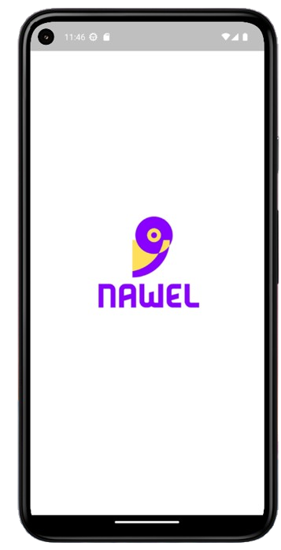
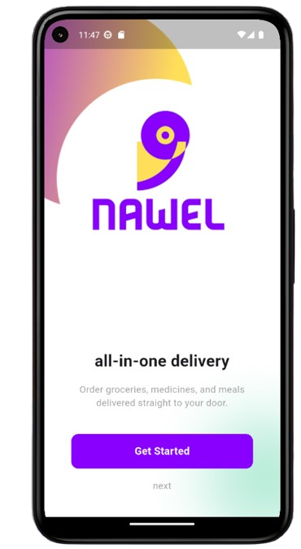
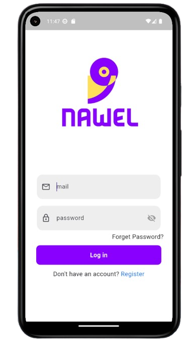
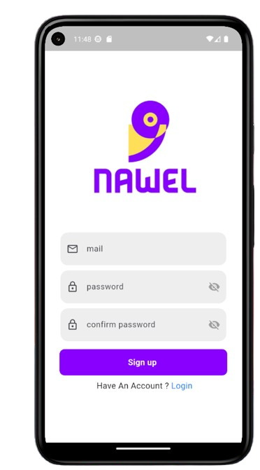
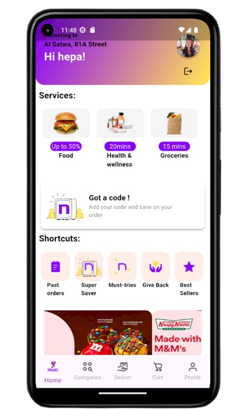
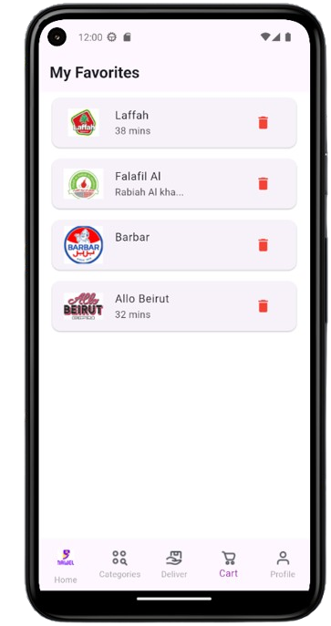

# 🛍️ simple_e_commerce_app

Flutter e-commerce app with clean UI, favorites system, and Firebase authentication.

---

## 🎬 Preview


- Splash Screen → Onboarding Pages → Sign In / Sign Up → Home Page

## 📸 Screenshots

| Splash Page | Onboarding Page |
|-------------|-----------------|
|  |  |

| Sign In Page | Sign Up Page |
|--------------|--------------|
|  |  |

| Home Page | Cart Page |
|------------|-----------|
|  |  |

---

## ✅ Features

-  Splash Screen == > When running the application
-  3 (Onboarding). == > 3 introductory pages
- (Sign In). == > To Login 
- (Sign Up).  == > To Register 
- (Home Page)  == >  Fast responsive UI.+  Fully synchronized using Bloc and Hive . clean architecture + When you click the heart button ❤️, the product is added to the cart page

---

## 🧠 Architecture

- ✅ Clean Architecture (Presentation, Domain, Data layers)
- 🧠 BLoC for State Management (flutter_bloc)
- 🔐 FirebaseAuth for login/register
- 🗃 Hive for local storage (favorites)
- 🎨 MediaQuery TO make Responsive UI

---

## 🚀 Get Started

```bash
git clone https://github.com/AhmedMohamed195/-AUVNET-Flutter-Internship-Assessment.git
cd Simple E-commerce App
flutter pub get
flutter run
